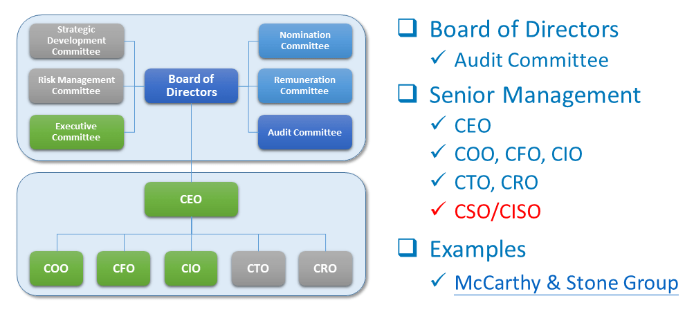
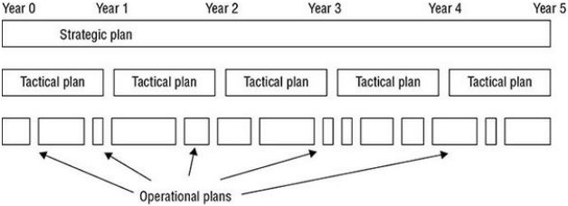
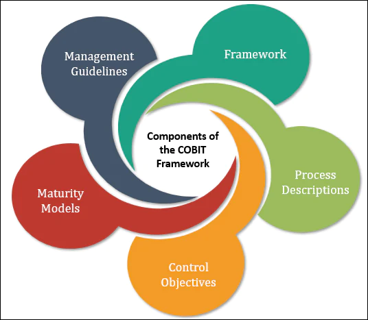

## Evaluate and Apply Security Governance Principles

### Security Governance
- **Definition**: Collection of practices for supporting, evaluating, defining, and directing an organization's security efforts.
- **Key Exam Point**: Understand security governance as a collection of practices related to supporting, defining, and directing an organization's security efforts.
- **Key Roles**:
  - Larger organizations: Board of directors.
  - Smaller organizations: CEO or CISO.
- **Board Composition**: Members from diverse backgrounds for varied experience and insight.
- **Relation with Corporate and IT Governance**: Often intertwined, with similar goals like maintaining business processes and striving for growth and resiliency.
- **Compliance Aspects**: Driven by laws, regulations, industry guidelines, or license requirements.
- **Challenges**: Varying and conflicting laws across different countries.
- **Organizational Impact**: Provides direction and tools for managing threats and risks, minimizing loss or damage.
- **Broader View**: Security governance is not just an IT issue; it's a business operations issue and affects every aspect of an organization.
- **Frameworks and Guidelines**: Inclusion of NIST SP 800-53 and NIST SP 800-100; adaptable for various organizations.

{#fig:Security Governance}
 
### Third-Party Governance
- **Overview**: System of overseeing external entities based on various mandates like law, regulation, or contractual obligations.
- **Key Exam Point**: Know about third-party governance, including the role of external auditors and the legal and regulatory requirements.
- **Auditors Role**: Can be external auditors designated by governing bodies or consultants hired by the organization.
- **Focus on Outsourced Operations**: Ensuring compliance with the primary organization's security standards.
- **Verification Process**: Includes on-site assessments, following protocols like COBIT, and investigating specific requirements.
- **Document Exchange and Review**: Involves open exchange and review of documents to ensure agreement on security issues and reduce misalignments or unrealistic expectations.

### Documentation Review
- **Process**: Reading and verifying exchanged materials against standards and expectations.
- **Key Exam Point**: Understand documentation review, especially the consequences of insufficient documentation in government or military contexts.
- **Pre-Inspection Review**: Ensuring documentation is sufficient and meets requirements before on-site reviews.
- **Consequences of Inadequate Documentation**: Potential postponement of reviews, and in cases involving government or military, loss or voiding of ATO.
- **Purpose of Review**: To confirm that business processes, policies, and systems align with security objectives and effectively manage risks.

## Manage the Security Function

### Overview
- **Purpose**: Focuses on evaluating and improving security over time.
- **Implementation**: Requires proper and sufficient security governance.

### Risk Assessment
- **Role in Security Management**: Directly drives the security policy.
- **Detailing**: Further discussed in Chapter 2 of the CISSP material.

### Measurable Security
- **Concept**: Security should be quantifiable to assess its effectiveness.
- **Security Metrics**:
  - **Function**: Includes measurements of performance, operation, and actions related to security features.
  - **Impact of Countermeasures**: Metrics should show a decrease in unwanted events or an increase in detection rates.
- **Evaluation**: Involves assessing the completeness and effectiveness of the security program against common security guidelines.

### Development and Implementation of Information Security Strategies
- **CISSP Exam Focus**: Covers various aspects of developing and implementing these strategies.
- **Integration with Management**: A key part of managing the security function.

### Conclusion
Managing the security function is a critical aspect of an organization's overall security posture, requiring careful measurement, risk assessment, and the development of comprehensive information security strategies.

## Alignment of Security Function to Business Strategy, Goals, Mission, and Objectives

### Security Management Planning
- **Purpose**: Aligns security functions with the organization's strategy, goals, mission, and objectives.
- **Key Exam Point**: Understand the alignment of security function to business strategy, goals, mission, and objectives.
- **Implementation**:
  - Designing and implementing security based on business cases and resource constraints.
  - Requires approval and commitment from senior management for success.

### Business Case in Security
- **Concept**: A documented argument to define a need for decision-making or action, particularly for initiating new security projects.
- **Key Exam Point**: Know what a business case is and its significance in security projects.
- **Resource Management**: Emphasizes maximizing benefits within resource limitations (money, people, technology, space).

### Top-Down vs. Bottom-Up Approaches
- **Top-Down Approach**: Initiated by senior management, providing overall direction for security policies.
- **Bottom-Up Approach**: IT staff make decisions without senior management input, considered less effective and problematic.

### Organizational Structure and Roles
- **Autonomous Security Team**: Led by a CISO reporting to senior management (CIO, CEO, Board).
- **Roles and Responsibilities**:
  - CISO: Oversees information security.
  - CSO: May focus on physical security.
  - CIO: Ensures effective information use.
  - CTO: Ensures proper functioning of equipment and software.

### Development of Security Plans
- **Key Exam Point**: Understand security management planning based on strategic, tactical, and operational plans.
- **Strategic Plan**:
  - Long-term, stable plan aligning security with organizational goals.
  - Includes risk assessment and revisited annually.
  - Useful for about five years.
- **Tactical Plan**:
  - Midterm plan providing details for achieving strategic goals.
  - Typically valid for about a year, includes project, acquisition, budget plans.
- **Operational Plan**:
  - Short-term, detailed plan based on strategic and tactical plans.
  - Regularly updated for compliance, includes resource allocation, staffing, scheduling.
  - Covers implementation in line with the security policy.
- **Continuous Process**: Security management planning is an ongoing activity, focusing on specific and achievable objectives.

### Importance of Security Documentation
- **Requirement**: Must be concrete, well-defined, and actively used.
- **Due Diligence and Due Care**: Developing and implementing a security policy demonstrates due diligence and care by senior management.

### Continuous Security Process
- **Nature of Security Management**: A continuous, ongoing process.
- **Focus on Objectives**: Anticipates changes and potential problems, serving as a basis for decision making across the organization.
- **Documentation**: Emphasizes the need for well-defined, concrete, and actively used security documentation.

### Conclusion
Aligning the security function with the business strategy involves careful planning and the development of strategic, tactical, and operational plans under the guidance of senior management. This ensures that security measures are in line with business objectives and resource constraints.

## Organizational Processes in Security Governance

### Overview
- **Scope**: Covers acquisitions, divestitures, governance committees, and other processes critical to security governance.
- **Key Exam Point**: Understand organizational process in security governance, including acquisitions, divestitures, and governance committees.
- **Purpose**: To address all aspects of an organization, ensuring comprehensive security coverage.

### Acquisitions and Mergers
- **Risks**: Increased risk of information disclosure, data loss, downtime, and ROI failure.
- **Security Oversight**: Essential for reducing risks during transformation periods.
- **Cost Considerations**: Evaluating the total cost of ownership versus initial costs.

### Divestitures
- **Risks**: Increased risk during asset or employee reduction.
- **Security Measures**: Sanitizing assets to prevent data leakage, including removal and destruction of storage media.
- **Employee Debriefing**: Involving exit interviews and review of binding agreements.

### Outsourcing and Contracting
- **Acquisition Scope**: Includes not just hardware and software but also services like outsourcing and consulting.
- **Security Integration**: Ensuring security assessments with external entities, ongoing monitoring, and management.
- **Third-Party Evaluations**:
  - On-Site Assessment: Visiting and observing operational habits.
  - Document Exchange and Review: Investigating data exchange processes.
  - Process/Policy Review: Assessing security policies and incident documentation.
  - Third-Party Audit: Independent audits based on SOC reports.

### Security Requirements in Acquisitions
- **Minimum Security Standards**: Should align with the organization's existing security policy.
- **Service-Level Agreements (SLA)**: Ensuring security components in contracted services.
- **Service-Level Requirements (SLR)**: Expectations of service from vendors, often informing SLAs.

### Essential Organizational Processes
- **Change Control/Management**: Critical for maintaining security during operational changes (detailed in Chapter 16).
- **Data Classification**: Vital for protecting security of assets (discussed in Chapter 5).

### Conclusion
Understanding and managing these organizational processes are essential for robust security governance, ensuring that every aspect of an organization's operations aligns with security objectives and policies.

## Organizational Roles and Responsibilities

### Overview
- **Purpose**: Defines roles in security implementation and administration within an organization.
- **Key Exam Point**: Understand key security roles, including senior manager, security professional, asset owner, custodian, user, and auditor.
- **Importance**: Helps establish a communication and support structure to deploy and enforce security policy.

### Key Security Roles
- **Senior Manager**:
  - **Responsibility**: Ultimate accountability for the organization's security.
  - **Role**: Authorizes and supports security policy; liable for security solution success or failure.
  - **Delegation**: Often delegates implementation to security professionals.

- **Security Professional**:
  - **Responsibility**: Functional responsibility for security, including policy writing and implementation.
  - **Role**: Follows directives from senior management; focuses on protection rather than just IT functionality.
  - **Team Involvement**: Often part of a team designing and implementing security solutions.

- **Asset Owner**:
  - **Responsibility**: Classifying information for placement and protection within the security solution.
  - **Delegation**: Usually delegates data management tasks to a custodian.

- **Custodian**:
  - **Responsibility**: Implementing protection as defined by the security policy and senior management.
  - **Tasks**: Includes data backup, integrity validation, security solution deployment, and data storage management.

- **User**:
  - **Role**: Any person with access to the secured system.
  - **Access Principle**: Access tied to work tasks, based on the principle of least privilege.
  - **Policy Adherence**: Responsible for understanding and upholding the security policy.

- **Auditor**:
  - **Function**: Reviews and verifies proper implementation of the security policy.
  - **Outputs**: Produces compliance and effectiveness reports for review by senior management.

### Role of Roles in Security Environment
- **Functionality**: These roles are crucial for identifying liability, responsibility, and the hierarchical management and delegation scheme within a secured environment.

### Conclusion
Understanding these organizational roles and responsibilities is key to effective security management, ensuring that each aspect of security policy is properly implemented and maintained across the organization.

## Security Control Frameworks

### Introduction
- **Purpose**: To consider the structure of the security solution desired by an organization.
- **Key Exam Point**: Know the basics of COBIT and its role in organizing complex security solutions.
- [Rest of the original content]
- **Variety**: Several frameworks available for different aspects of IT security and governance.

### COBIT Framework
- **Developed by**: Information Systems Audit and Control Association (ISACA).
- **Function**: Prescribes goals and requirements for security controls, aligning IT security with business objectives.
- **Key Principles**:
  - Provide Stakeholder Value.
  - Holistic Approach.
  - Dynamic Governance System.
  - Governance Distinct from Management.
  - Tailored to Enterprise Needs.
  - End-to-End Governance System.
- **Usage**: For planning IT security and as a guideline for auditors.
- **Reference**: Visit ISACA website or read COBIT entry on Wikipedia for more details.

### Other IT Security Standards and Guidelines
- **NIST SP 800-53 Rev. 5**:
  - Focus: Security and Privacy Controls for Information Systems and Organizations.
  - Source: U.S. government–sourced general recommendations.

- **Center for Internet Security (CIS)**:
  - Provides security configuration guides for OS, applications, and hardware.

- **NIST Risk Management Framework (RMF)**:
  - Reference: NIST SP 800-37.
  - Phases: Categorize, Select, Implement, Assess, Authorize, and Monitor.
  - Mandatory for federal agencies.

- **NIST Cybersecurity Framework (CSF)**:
  - Reference: NIST Framework for Improving Critical Infrastructure Cybersecurity.
  - Designed for critical infrastructure and commercial organizations.
  - Functions: Identify, Protect, Detect, Respond, Recover.

- **ISO/IEC 27000 Family**:
  - An international standard for implementing organizational security and management practices.

- **Information Technology Infrastructure Library (ITIL)**:
  - Set of best practices for IT service optimization to support business objectives.
  - Focuses on integrating IT and security with organizational objectives.

Understanding various security control frameworks and standards, such as COBIT, NIST, CIS, ISO/IEC, and ITIL, is crucial for effectively planning and managing IT security in alignment with organizational goals and needs.

## Due Diligence and Due Care

### Importance of Planning in Security
- **Key Question**: Why is planning security so important?
- **Answer**: The necessity of due diligence and due care in protecting an organization's interests.
- **Key Exam Point**: Understand due diligence and due care - due diligence is about planning and due care is about action.

### Due Diligence
- **Definition**: Establishing a plan, policy, and process for organizational protection.
- **Examples**:
  - Developing a formalized security structure.
  - Containing security policy, standards, baselines, guidelines, and procedures.

### Due Care
- **Definition**: Practicing activities that maintain the due diligence effort.
- **Application**: Continuous application of the security structure onto the IT infrastructure.
- **Responsibility**: All parties within an organization play a role in ongoing operational security.

### Relationship Between Due Diligence and Due Care
- **Due Diligence**: Knowing what should be done and planning for it.
- **Due Care**: Doing the right action at the right time.
- **Business Environment**: Prudence is mandatory to avoid negligence in case of loss.

### Senior Management's Role
- **Responsibility**: Demonstrating due care and due diligence.
- **Purpose**: To reduce culpability and liability in the event of a loss.

### Conclusion
Understanding the concepts of due diligence and due care is critical for any security professional. These practices are essential for developing robust security strategies and for proving prudence and responsibility in an organization's security efforts.
