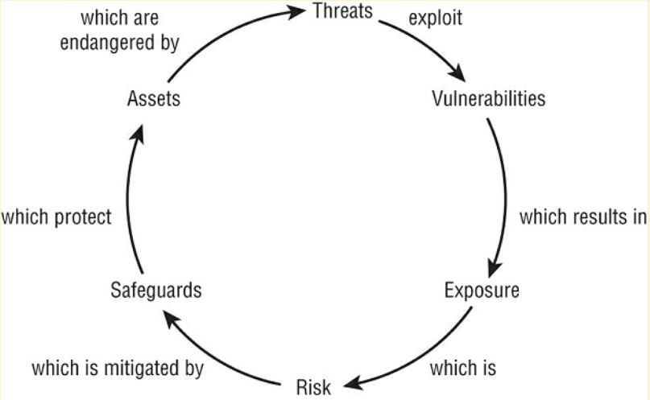
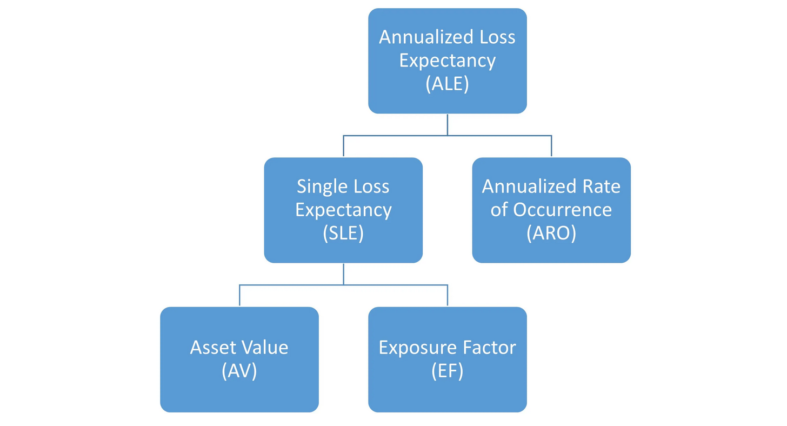

## Understand and Apply Risk Management Concepts

### Overview of Risk Management
- **Definition**: Risk management involves identifying potential risks, evaluating them against asset value and mitigation costs, and implementing solutions to reduce risk.
- **Purpose**: To develop and sustain an organization's security infrastructure in line with its mission.
- **Initial Application**: Forms the basis of a security policy.
- **Goal**: Reduce risk to an acceptable level, which varies based on organizational factors.

### Risk Evaluation
- **Broad Scope**: Considers risks from both IT and non-IT sources, including accidents, natural disasters, financial threats, civil unrest, pandemics, physical threats, technical exploitations, and social engineering attacks.
- **Comprehensive Approach**: Ensures no significant risk is overlooked, safeguarding the company from various vulnerabilities.

### Elements of Risk Management
- **Risk Assessment/Analysis**: Examines the environment for risks, evaluates threat likelihood and impact, and assesses countermeasure costs. Results in prioritized risks.
- **Risk Response**: Involves cost/benefit analysis of countermeasures and proposing response options to senior management for decision-making and implementation.
  
### Risk Awareness
- **Concept**: Effort to increase organizational knowledge of risks.
- **Components**: Understanding asset value, identifying potential threats, and being informed about implemented risk responses.
- **Importance**: Encourages adherence to security policies and highlights consequences of security failures.

## Risk Terminology and Concepts

### Key Terms
- **Asset**: Anything used in a business process, tangible or intangible.
- **Asset Valuation**: Assigning value to an asset based on various factors including cost, importance, and nonmonetary expenses.
- **Threats**: Potential occurrences that may cause harm to an organization or assets.
- **Threat Agent/Actors**: Individuals or entities intentionally exploiting vulnerabilities.
- **Threat Events**: Accidental or intentional exploitations of vulnerabilities, natural or person-made.
- **Threat Vector**: The path or means by which an attack gains access to a target.
- **Vulnerability**: Weakness or absence of a safeguard in an asset.
- **Exposure**: Susceptibility to asset loss due to a threat.

### Risk Definition and Formula

- **Risk Explained**: 
  - In information security, risk is the possibility or likelihood that a threat will exploit a vulnerability, leading to harm. This harm could include data breaches, system failures, or financial loss. Risk is tied to vulnerabilities (weaknesses in security) that can be exploited by threats (anything causing harm).

- **Risk Formula Expanded**:
  - `Risk = Threat * Vulnerability`: 
    - This formula shows risk increases with the presence of threats and vulnerabilities. Higher threat levels combined with significant vulnerabilities lead to higher risk. For example, a known software security flaw (vulnerability) with increasing attacks (threat) heightens the risk.
  - `Risk = Probability of Harm * Severity of Harm`: 
    - This version considers the impact of threats and vulnerabilities.
    - **Probability of Harm**: Measures the likelihood that a vulnerability will be exploited. For example, a system frequently targeted by hackers has a higher probability of harm.
    - **Severity of Harm**: Measures the potential impact if a vulnerability is exploited, ranging from minimal inconvenience to substantial financial and reputational damage.

  Understanding these risk aspects helps prioritize security measures and effectively allocate resources to address the most probable and severe risks.

### Safeguards, Attacks, and Breaches
- **Safeguards**:
  - Definition: Actions or products that reduce risk by eliminating or lessening threats or vulnerabilities.
  - Examples: Implementing firewalls, antivirus software, regular security audits, and security awareness training.
- **Attack**:
  - Definition: An intentional attempt to exploit a vulnerability.
  - Example: A hacker exploiting a software vulnerability to gain unauthorized access to sensitive data.
- **Breach**:
  - Definition: A successful attack resulting in the bypassing or failure of security mechanisms.
  - Example: Unauthorized access to a database containing personal customer information.

### Risk Elements and Their Relationships
- **Risk Elements Relationships**:
  - Overview: Understanding how threats, vulnerabilities, exposure, and safeguards are interconnected in the risk management process.
  - Key Relationships:
    - Threats exploit vulnerabilities, leading to potential exposure.
    - Exposure, when vulnerabilities are present and threats are likely, creates risk.
    - Safeguards are implemented to mitigate these risks by addressing vulnerabilities and reducing the potential of threats.
- **Cyclical Nature of Risk Elements**:
  - Understanding the continuous cycle of identifying and responding to risks.
  - This cycle involves constantly evaluating assets for vulnerabilities, assessing potential threats, implementing safeguards, and then reassessing the landscape for new risks.

### Approaches to Risk Assessment
- **Threat-Based Assessment**:
  - Focuses on identifying potential threats first.
  - Then, it assesses which assets could be harmed by these threats.
  - Example: Identifying potential cyberattacks and then determining which systems are most vulnerable to these attacks.
- **Asset-Based Assessment**:
  - Begins by inventorying assets.
  - Then, it identifies which threats could potentially cause harm to these assets.
  - Example: Cataloging company data assets and then assessing which types of data breaches could affect them.

The cyclical and interconnected nature of risk elements in management requires a dynamic and ongoing approach to risk assessment, addressing both threats and assets systematically.

## Asset Valuation in Risk Management

### Importance of Asset Valuation
- **Purpose**: Determines the worth of assets to guide protection levels.
- **Cost-Effectiveness**: Ensures safeguard costs do not exceed potential loss.

### Valuation Factors
- **Tangible Costs**:
  - Purchase, development, administrative, and maintenance costs.
  - Costs related to acquiring, protecting, and sustaining the asset.
- **Intangible Factors**:
  - Value to owners, users, and competitors.
  - Intellectual property and market valuation.
  - Replacement cost and productivity impact.
  - Liability and legal implications of asset loss.

### Key Goals of Asset Valuation
- **Foundation for Cost/Benefit Analysis**: Essential for safeguard selection.
- **Insurance and Net Worth**: Assists in establishing organizational net worth.
- **Senior Management Insight**: Provides clarity on organizational risks.
- **Legal Compliance**: Supports adherence to legal and regulatory requirements.

### Asset Valuation in Threat-Based Analysis
- **Post-Threat Inventory**: Asset valuation occurs after identifying vulnerable assets.
- **Integrating Asset Worth**: Vital for prioritizing risk management efforts.

> **Highlight**: Asset valuation is not just about assigning a dollar figure; it encompasses a comprehensive understanding of an asset's value to the organization, balancing tangible and intangible factors.

## Identify Threats and Vulnerabilities

### Creating a Comprehensive Threat List
- **Objective**: Compile an exhaustive list of all possible threats to the organization's assets.
- **Inclusivity**: Include both threat agents and threat events, considering a wide range of sources.
- **NIST SP 800-30r1 Reference**: For an expansive list of threat examples, consult NIST SP 800-30r1 Appendix D and E.
- **Diverse Sources**: Remember that IT threats can originate from non-IT sources.

### Team-Based Risk Assessment
- **Collaborative Approach**: Risk assessment is most effective when performed by a diverse team.
- **Team Composition**: Members from various departments, not limited to security professionals.
- **Benefits of Diversity**: Ensures a thorough and inclusive identification of potential threats.

### Utilizing Consultants for Risk Assessment
- **The Consultant Cavalry**: Engaging risk management consultants for complex assessments.
- **Advantages**:
  - Brings specialized expertise.
  - Alleviates workload from employees.
  - Offers more reliable and standardized risk measurement.
- **Use of Software Tools**: Consultants often employ risk assessment software for efficiency and standardized reporting.

> **Highlight**: Comprehensive threat identification is crucial in risk management. It involves diverse inputs from across the organization and, in complex scenarios, the expertise of external consultants and specialized software tools.

## Risk Assessment/Analysis

### Role of Upper Management
- **Responsibility Assignment**: Upper management delegates risk analysis tasks to IT and security teams.
- **Decision Making**: Final decisions on risk responses are made by upper management.
- **Initiative and Support**: Upper management defines the scope and purpose of risk assessments.

### Acceptable Risk
- **Inevitability of Risk**: All IT systems, organizations, and tasks inherently involve risk.
- **Acceptable vs. Unacceptable Risk**: Management must decide which risks are tolerable based on complex assessments and organizational factors.

### Organizational Specificity of Risk
- **Subjectivity**: Risk perception varies between organizations based on their unique contexts.
- **Personalization of Risk**: Risk is specific to an organization's assets, threats, and risk tolerance.

### Risk Assessment Methodologies
- **Quantitative Analysis**: Uses mathematical calculations and assigns monetary values to asset loss.
- **Qualitative Analysis**: Based on subjective values and considerations like intuition and preferences.
- **Hybrid Approach**: Most organizations use a combination of both methodologies for a balanced view.

### Risk Assessment Goals and Approaches
- **Criticality Prioritization**: Identify and rank risks to optimize resource allocation for protection.
- **Quantitative vs. Qualitative**: Viewed as distinct methods or as part of a sliding scale.
- **Matrix Approach**: Using a probability vs. damage matrix (3×3, 5×5, etc.) for qualitative assessment.
- **Adjustment Mechanism**: Using one approach to fine-tune or modify the results of the other.

> **Highlight**: Effective risk assessment involves a combination of methodologies and the active role of upper management in decision-making. It requires a tailored approach, considering the unique risk landscape of each organization.

## Qualitative Risk Analysis

Qualitative Risk Analysis is a risk assessment method focusing on subjective evaluation of risks rather than precise mathematical calculations. It involves assessing the severity of risk impacts and the likelihood of their occurrence using non-numeric criteria, often relying on expert judgment and experience. This approach is useful for understanding and prioritizing risks when numerical data is unavailable or when a more nuanced understanding of risk factors is needed. Techniques such as brainstorming, scenario analysis, and the Delphi method are commonly used to gather diverse insights and reach a consensus on risk priorities.

### Overview
- **Nature**: Scenario-based, not purely calculator-based.
- **Relative Ranking**: Threats are ranked on a relative scale.
- **Balance**: Balances results from quantitative analysis; not purely quantitative.

### Hybrid Assessment
- **Combination**: Merges quantitative and qualitative analysis.
- **Hybrid Analysis**: Essential for a comprehensive assessment of organizational risk.

### Techniques and Methods
- **Approach**: Involves judgment, intuition, and experience.
- **Techniques Used**:
  - Brainstorming
  - Storyboarding
  - Focus groups
  - Surveys
  - Questionnaires
  - Checklists
  - One-on-one meetings
  - Interviews
  - Scenarios
  - Delphi technique
- **Selection Criteria**: Based on organizational culture and types of risks and assets.
- **Multipronged Approach**: Employing several methods simultaneously for comprehensive analysis.

### Scenarios
- **Description**: Written description of a major threat and its potential effects.
- **Format**: Generally limited to one page; focuses on instigation and impact.
- **Analysis**: Participants assign threat levels, loss potentials, and evaluate safeguards.
- **Response Assignment**: High, Medium, Low, or numerical scale (1 to 10).
- **Compilation**: Responses compiled into a report for management.
- **Reference**: For detailed ratings and levels, see NIST SP 800-30 Rev.1 Tables.

### Delphi Technique
- **Purpose**: To reach an anonymous consensus among a group.
- **Process**: Anonymous feedback and response to facilitate unbiased evaluation.
- **Goal**: Evaluating ideas based on merit without influence from the originator.

> **Highlight**: Qualitative risk analysis relies on diverse techniques to create a scenario-based assessment. It is crucial for ensuring a comprehensive understanding of risks, where the Delphi technique and scenarios play a significant role in facilitating group consensus and thorough analysis.

## Enhanced Quantitative Risk Analysis Overview

Quantitative risk analysis quantifies the risks in monetary terms, providing a clearer picture of potential financial losses and guiding cost-effective countermeasures. It’s crucial for decision-making in risk management.

### Key Steps in Quantitative Risk Analysis

1. **Asset Valuation (AV)**:
   - **Description**: Determining the monetary value of each asset.
   - **Example**: A server's purchase price is $5,000; its AV is set at $5,000.
   - **Purpose**: To inform the level of investment in safeguarding the asset.

2. **Threat Identification**:
   - **Activity**: Cataloging threats for each asset, resulting in asset-threat pairings.
   - **Example**: Identifying malware as a threat to the server.

3. **Exposure Factor (EF) Calculation**:
   - **Definition**: The percentage of asset value potentially lost due to a threat.
   - **Formula**: `EF = (Potential Loss from Threat / Asset Value) * 100`
   - **Example**: If malware can potentially cause a 40% loss of the server, EF = 40%.

4. **Single Loss Expectancy (SLE)**:
   - **Concept**: The financial loss expected from a single threat occurrence.
   - **Formula**: `SLE = AV * EF`
   - **Example**: For our server (AV = $5,000) and malware threat (EF = 40%), SLE = $2,000.

5. **Annualized Rate of Occurrence (ARO)**:
   - **Meaning**: The expected frequency of a threat occurring per year.
   - **Considerations**: Historical data, industry reports.
   - **Example**: If malware attacks are expected twice a year, ARO = 2.

6. **Annualized Loss Expectancy (ALE)**:
   - **Role**: Projecting the yearly financial impact of a threat.
   - **Formula**: `ALE = SLE * ARO`
   - **Example**: With SLE = $2,000 and ARO = 2, ALE for malware threat = $4,000.

### In-Depth Comparative Analysis: Quantitative vs. Qualitative

| Characteristic | Qualitative | Quantitative |
|----------------|-------------|--------------|
| Employs math functions | No | Yes |
| Uses cost/benefit analysis | May | Yes |
| Requires estimation | Yes | Some |
| Supports automation | No | Yes |
| High volume of information | No | Yes |
| Objectivity | Less | More |
| Relies on opinion | Yes | No |
| Time and effort needed | Sometimes | Yes |
| Meaningful outcomes | Yes | Yes |

### Transitioning to Risk Response

- **Next Steps**: After assessing risks quantitatively, the focus shifts to choosing the most effective risk responses based on calculated ALEs and organizational priorities.

## Risk Responses in Risk Management

### Types of Risk Responses
- **Mitigation/Reduction**: Implementing safeguards to lessen threats/vulnerabilities. 
  - *Example*: Using firewalls to reduce network vulnerabilities.
- **Assignment/Transfer**: Shifting risk responsibility to another entity. 
  - *Example*: Purchasing insurance to transfer financial risk.
- **Deterrence**: Discouraging potential security violations.
  - *Example*: Using security cameras to deter unauthorized access.
- **Avoidance**: Choosing alternative activities with lower risk.
  - *Example*: Using cloud storage to avoid data loss risks from local hardware failure.
- **Acceptance**: Acknowledging and accepting the consequences of risks.
  - *Example*: Accepting the risk of a data breach in a low-priority system where safeguard costs are prohibitive.
- **Rejection/Ignorance**: Denying the existence of a risk or hoping it will never be realized.
  - *Note*: This approach is generally not advisable and may be considered negligence.

### Understanding Inherent, Residual, and Total Risk
- **Inherent Risk**
  - **Definition**: The natural level of risk in a process or system before applying controls.
  - **Example**: A new app's inherent cybersecurity risks due to potential code vulnerabilities.
  - **Importance**: Crucial for baseline risk understanding and strategy planning.
- **Residual Risk**
  - **Definition**: Risk level remaining after applying security controls and strategies.
  - **Example**: Remaining risk of a data breach after implementing firewalls and intrusion detection.
  - **Formula Explanation**: `Residual Risk = Total Risk - Controls Gap`. This formula helps quantify the risk that persists after mitigation efforts.
  - **Controls Gap**: The difference between the total risk and the risk mitigated by implemented controls. It represents the effectiveness of the controls in reducing risk.
- **Total Risk**
  - **Definition**: The complete spectrum of risks an organization faces before implementing any risk controls or mitigation strategies.
  - **Example**: Total risk for an IT system includes risks from cyber-attacks, data loss, system failures, and insider threats.
  - **Formula Explanation**: `Total Risk = Threats * Vulnerabilities * Asset Value`. This formula quantifies the overall risk by considering potential threats, existing vulnerabilities, and the value of the assets at risk.
  - **Significance**: Understanding total risk is vital for making informed decisions about which controls to implement and where to allocate resources for risk mitigation.

### Continuous Risk Assessment
- **Ongoing Process**: Risk management is a continuous process that requires regular reassessment to ensure that controls are still effective and that new risks are identified and managed.
- **Adapting to Changes**: As the organizational environment and threat landscape evolve, so too should the risk management strategies to maintain effective security and compliance.

> **Highlight**: These key risk concepts are fundamental in risk management. Inherent risk sets the stage for understanding initial vulnerabilities, residual risk shows the effectiveness of controls, and total risk provides a comprehensive view of the potential challenges an organization may face. Regularly assessing these risks ensures that an organization's risk management approach remains robust and relevant.

